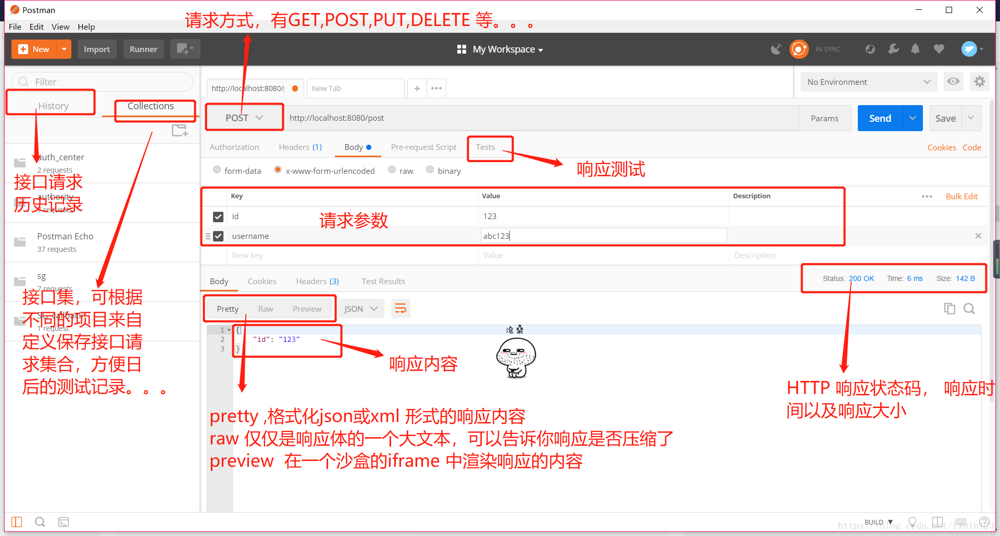
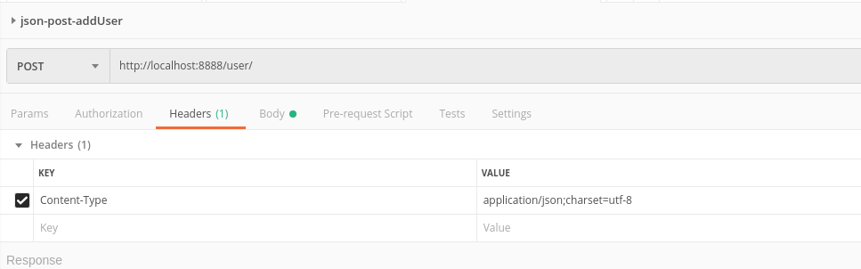
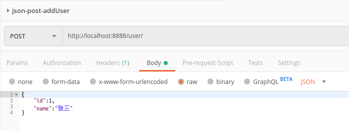
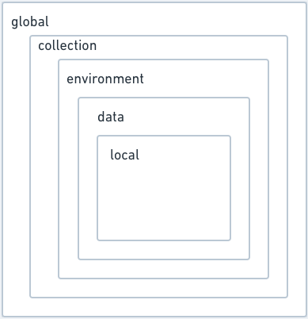
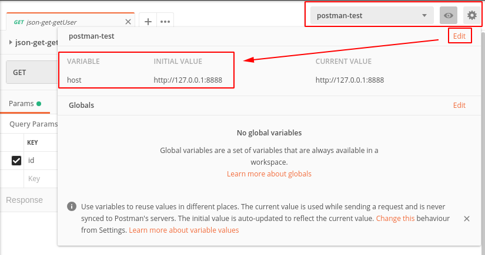
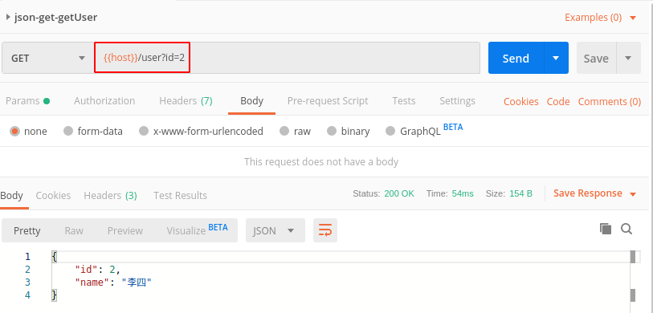

# postman使用介绍
## 用途
* **接口请求客户端(API-Client)**    
 Quickly and easily send [REST](#REST),[SOAP](#SOAP) and GraphQL requests directly within Postman
* **自动化测试(Automated Testing)**   
 Automate manual tests and integrate them into your CI/CD pipeline to ensure that
 any code changes won't break the API in production.
* **设计和模拟(Design & Mock)**  
Communicate the expected behavior of an API by simulating endpoints and their reponses
 without having to set up a backend server.
* 文档输出(Documentation)
Generate and publish beautiful, machine-readable documentation to make your API easier
 to consume.
* **接口状态监控(Monitors)**  
Stary up-to-date on the health of your API bu checking performance and reponse  
thies at scheduled intervals.
* **工作空间(Workspaces)**  
Provide a shared context for building and consuming APIs, nad collaborate in real-time
with  built-in version.
## 界面介绍
### 主界面

## 用法
### 基本:API请求
* method:POST,Content-Type:json
1. 填写requestUrl和requestMethod
2. 设定请求头Content-Type为json形式

3. 填写post的body:选择raw,并填写json内容

### 变量
#### 变量的功能
变量能存储值并在任意地方使用，也可以作为值传递的一种方式。变量根据作用域的不同分为全局变量
/环境变量/文件夹变量等
#### 变量作用范围  
* Global：全局变量，作用域最大，比如host设置
* Collection：集合变量，作用域为集合内
* Environment：环境变量，自定义后可自由选择，作用域小于Collection
* Data：比如Runner运行过程中参数化选择的.csv文件
* Local：前置数据处理与后置数据断言写的js脚本中自定义的变量，作用域最小  
如下.

#### 变量的使用
如 配置环境变量
1. 配置  

2. 使用，采用{{var}}的形式调用

##### 附录
###### REST  
[表现层状态转换](https://zh.wikipedia.org/wiki/%E8%A1%A8%E7%8E%B0%E5%B1%82%E7%8A%B6%E6%80%81%E8%BD%AC%E6%8D%A2)（英语：Representational State Transfer，缩写：REST）是Roy Thomas Fielding博
士于2000年在他的博士论文中提出来的一种万维网软件架构风格，目的是便于不同软件/程序在
网络（例如互联网）中互相传递信息。表现层状态转换是根基于超文本传输协议(HTTP)之上而确定
的一组约束和属性，是一种设计提供万维网络服务的软件构建风格。符合或兼容于这种架构风格
(简称为 REST 或 RESTful)的网络服务，允许客户端发出以统一资源标识符访问和操作网络资源
的请求，而与预先定义好的无状态操作集一致化。因此表现层状态转换提供了在互联网络的计算
系统之间，彼此资源可交互使用的协作性质(interoperability)。相对于其它种类的网络服务，
例如 SOAP服务则是以本身所定义的操作集，来访问网络上的资源。  
当前在三种主流的Web服务实现方案中，因为REST模式与复杂的SOAP和XML-RPC相比更加简洁，
越来越多的web服务开始采用REST风格设计和实现。例如，Amazon.com提供接近REST风格的Web服
务运行图书查询；雅虎提供的Web服务也是REST风格的
###### SOAP    
[SOAP](https://zh.wikipedia.org/wiki/%E7%AE%80%E5%8D%95%E5%AF%B9%E8%B1%A1%E8%AE%BF%E9%97%AE%E5%8D%8F%E8%AE%AE)（原为Simple Object Access Protocol的首字母缩写，即简单对象访问协议）是交换数据
的一种协议规范，使用在计算机网络Web服务（web service）中，交换带结构信息。SOAP为了简
化网页服务器（Web Server）从XML数据库中提取数据时，节省去格式化页面时间，以及不同应用
程序之间按照HTTP通信协议，遵从XML格式执行资料互换，使其抽象于语言实现、平台和硬件。
此标准由IBM、Microsoft、UserLand和DevelopMentor在1998年共同提出，并得到IBM，莲花（Lotus）
，康柏（Compaq）等公司的支持，于2000年提交给万维网联盟（World Wide Web Consortium；W3C）
，目前SOAP 1.1版是业界共同的标准，属于第二代的XML协定（第一代具主要代表性的技术为XML-RPC
以及WDDX）
###### GraphQL
[GraphQL](https://zh.wikipedia.org/wiki/GraphQL)是一个开源的API数据查询和操作语言及实现
为了实现上述操作的相应运行环境。2012年，GraphQL由Facebook内部开发，2015年公开公布。 
2018年11月7日，Facebook将GraphQL项目转移到新成立的GraphQL基金会（隶属于非营利性的Linux基
金会）。  
GraphQL相较于REST以及其他web service架构提供了一种高效、强大和灵活的开发web APIs的方式。
它通过由客户端根据所需定义数据结构，同时由服务端负责返回相同数据结构的对应数据的方式
避免了服务端大量冗余数据的返回，但与此同时也意味着这种方式不能有效利用起查询结果的web
缓存。GraphQL这种查询语言所带来的灵活性和丰富性的同时也增加了复杂性，使得这项技术对于
简单APIs并不是好的选择。
